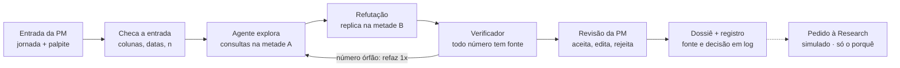

# Agente Dossiê de Hipóteses

**Hackathon Itaú · Grupo 13 · Case C · Pessoa: PM da squad de cartões**

> ⚠️ **Protótipo de hackathon.** Todos os dados são **fictícios** (sintéticos, gerados com semente fixa e padrões plantados). O envio de pedidos à Research é **simulado**. Nada aqui usa dados reais do banco.

## A ideia em uma frase

Queremos ajudar a PM da squad de cartões a transformar dados de FullStory e tagueamento em hipóteses priorizadas com evidência, quando precisa decidir o que investigar na jornada de bloqueio, porque hoje analisar milhões de eventos é manual e inviável. Saberemos que ajudamos se ela chegar a um dossiê verificável em minutos, sem números sem fonte.

## O que o agente faz

- **Entrada:** jornada (bloquear/desbloquear cartão), período e, opcionalmente, um palpite da PM ("acho que idosos travam na confirmação").
- **Ação:** o agente explora os dados com consultas executadas por código, gera hipóteses candidatas, tenta refutá-las numa metade separada dos dados e redige o dossiê.
- **Resultado:** dossiê com hipóteses ranqueadas (quantos, quem, lift, n, fonte), separando o que o dado já responde do que só a Research responde ("por quê"), mais o registro da decisão da PM.

**Regra de ouro:** números saem de consultas executadas por código, nunca do LLM. O LLM planeja, escolhe consultas e redige; o código calcula e confere.

## Como funciona (8 etapas, 1 decisão humana)

Se o verificador achar um número sem consulta correspondente, o agente refaz uma vez; se falhar de novo, a hipótese sai marcada como "não verificada".

### Rótulos de confiança (regras fixas no código)

| Rótulo | Quando |
|---|---|
| **Evidência** | padrão replica na metade B, n acima do mínimo e lift claramente diferente de 1 |
| **Indício** | aparece na metade A, mas não replica ou tem n pequeno |
| **Hipótese** | explicação causal ("porque..."); sempre depende de Research ou experimento |
| **Lacuna** | a pergunta não pode ser respondida com os dados enviados |

Cada hipótese no dossiê traz: enunciado · quantos usuários afetados · quem (perfil com lift vs base) · n · rótulo · `query_id`s clicáveis · o que o dado responde · o que só a Research responde · decisão da PM.

## O que é real, simulado e futuro

| Parte | Status no hackathon |
|---|---|
| Motor de consultas, agente, verificador de números, tela de revisão, dossiê, registro | **Funciona de verdade** |
| Dados de FullStory, tagueamento, perfil e NPS | Simulado (sintéticos, com semente e padrões conhecidos) |
| Conectores FullStory/GA/data mesh | Simulado (upload de CSV) |
| Envio do pedido à Research, criação de card no backlog | Simulado (gera o pedido, não envia) |
| Conexão real a dados do banco, acompanhamento pós-lançamento | Futuro |

**Fora do escopo:** mais agentes, dashboard genérico, agente de código, qualquer aprovação automática.

## Dados sintéticos e gabarito

Quatro arquivos CSV: cerca de 200 mil usuários, 1 milhão de eventos de tagueamento e uma amostra de FullStory de 10% das sessões (o dossiê avisa que esses números são extrapolados).

| Arquivo | Papel | Colunas mínimas |
|---|---|---|
| `tagueamento.csv` | Funil e volume por etapa | `user_id_hash`, `session_id`, `timestamp`, `event_name`, `platform`, `app_version` |
| `fullstory.csv` | Atrito: dead/rage click, tempo | `session_id`, `user_id_hash`, `timestamp`, `page`, `event_type`, `element`, `time_on_page_s` |
| `perfil.csv` | Quem é afetado (lift vs base) | `user_id_hash`, `faixa_etaria`, `segmento`, `plataforma`, `tempo_de_conta` |
| `nps.csv` (opcional) | Pista do "porquê" | `user_id_hash`, `score`, `comentario` |

Eventos do funil: `card_lock_start`, `card_select`, `lock_reason_select`, `lock_confirm`, `lock_success`, `lock_error`, `unlock_start`, `unlock_success`.

**Padrões plantados (gabarito)**, para medir se o agente acha o que existe e ignora armadilhas:

1. **Dead click na confirmação** numa versão específica do Android → deve virar *evidência*.
2. **Travamento por faixa etária:** usuários 60+ demoram e dão rage click na escolha do motivo → deve ser achado, com lift real.
3. **Bloqueia e desbloqueia rápido** (< 10 min) → deve aparecer como *hipótese* para a Research.
4. **Armadilha de taxa-base:** segmento de maior volume com lift ≈ 1 → **não** pode virar insight.
5. **Armadilha de amostra pequena:** taxa altíssima com n abaixo do mínimo → indício ou suprimido, nunca evidência.
6. Ruído aleatório em todo o resto.

**Entradas de teste:** normal · incompleta (sem `perfil.csv` → segue e declara a lacuna "não dá para dizer quem") · incorreta (`timestamp` inválido ou período vazio → bloqueia com mensagem clara) · palpite vago ("o app é ruim" → pede métrica e etapa ou explora aberto e avisa).

## Stack

| Camada | Escolha |
|---|---|
| Interface | Streamlit |
| Motor analítico | DuckDB + pandas sobre CSV/Parquet; cada consulta recebe um `query_id` |
| Agente | API de LLM com tool use e saída em JSON schema (ex.: Claude) |
| Validação | pydantic (hipóteses) + checagem dos CSVs |
| Registro | JSONL ou SQLite |
| Dossiê | Markdown na tela + download em PDF ou `.md` |
| Publicação | GitHub + Streamlit Community Cloud; chave da API em *secrets*, nunca no código |

Decisões que economizam tempo: ferramentas parametrizadas em vez de SQL livre gerado pelo LLM; limite de 8–10 chamadas de ferramenta por execução (resposta abaixo de 1 min); **modo demo** com execução gravada como contingência se a API ou a internet falharem na banca.

## Governança e privacidade

| Quem | Pode | Não pode |
|---|---|---|
| Agente | Ler esquema e agregados, rodar consultas do catálogo, propor e refutar hipóteses, redigir o dossiê | Ver linhas individuais, acessar sistemas reais, encaminhar à Research, mexer no backlog, decidir |
| Verificador (código) | Bloquear número sem fonte, rebaixar rótulo, suprimir grupos pequenos | Criar conteúdo |
| PM | Aceitar, editar, rejeitar, pedir mais análise, encaminhar à Research | Remover o registro do que o agente propôs |
| Research | Aceitar ou devolver o pedido (simulado) | — |
| Risco | Consultar o registro completo | — |

- `user_id` sempre pseudonimizado; o LLM nunca recebe linhas individuais (só esquema e agregados); grupos com menos de 50 usuários não são exibidos.
- Comentários de NPS são tratados como dado, nunca como instrução (proteção contra *prompt injection*).
- O registro guarda versão do prompt e do modelo para reproduzir qualquer resultado; o dossiê sempre avisa que correlação não é causa.

## Divisão da squad

| Papel | Entrega principal |
|---|---|
| **P1 — Dados e motor** | Gerador sintético, gabarito dos padrões, catálogo de consultas DuckDB, testes das consultas |
| **P2 — Agente e verificador** | Prompt, loop de tool use, schema da hipótese, holdout, verificador de números, log |
| **P3 — App e experiência** | Telas de entrada, progresso, revisão e dossiê; publicação; modo demo |
| **P4 — Produto, evidência e narrativa** | 2ª conversa com Rafael/Marcos, linha de base manual, teste com pessoa de fora, PR/FAQ, slides, roteiro da demo |

**Rituais:** checkpoint de 10 min a cada 2 horas · arquivo de decisões · `main` sempre rodando, cada frente em branch e integra nos checkpoints · cada pessoa sabe explicar a própria contribuição e as escolhas do time.

## Cronograma (cerca de 10 h a partir de H0)

| Fase | Horas | Portão para avançar |
|---|---|---|
| 0. Contratos | H0–H1 | Esquema dos CSVs, JSON da hipótese e assinatura das tools no repositório, todos de acordo |
| 1. Esqueleto | H1–H3 | Fluxo ponta a ponta clicável, mesmo com dados falsos |
| 2. Motor real | H3–H6 | Entrada normal acha os padrões 1 e 2 e não cai nas armadilhas 4 e 5 |
| 3. Governança e bordas | H6–H7,5 | As três entradas de teste passam; log mostra quem decidiu |
| 4. Teste externo | H7,5–H8,5 | Um teste com pessoa de fora registrado e uma mudança feita por causa dele |
| **Congelamento** | H8,5 | Versão final marcada (tag no Git) |
| 5. Materiais | H8,5–H10,5 | Links abertos em aba anônima; ensaio de 4 min cronometrado |

Se atrasar, cortar nesta ordem: NPS → holdout (manter só o verificador) → edição de hipótese (manter aceitar/rejeitar). **Nunca cortar:** verificador de números, entrada incompleta, registro da decisão e teste com pessoa de fora.

## Entregáveis

- **MVP:** app publicado + este repositório com README (como rodar, o que é simulado, dados fictícios).
- **Slides:** até 10 (mirar em 8).
- **Demo:** até 2 min, uma tarefa real no protótipo, pública no YouTube.
- **Ficha PR/FAQ:** até 2 páginas, press release de 100–150 palavras, cinco perguntas e aviso de exercício fictício.

Os quatro materiais contam a mesma história, com a mesma entrada de exemplo e a mesma versão congelada.

## Como rodar

Em construção. O esqueleto do app (Streamlit) entra na Fase 1.
