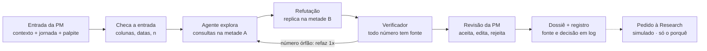

# Agente Dossiê de Hipóteses

**Hackathon Itaú · Grupo 13 · Case C · Pessoa: PM de uma squad de produto digital**

> ⚠️ **Protótipo de hackathon.** Todos os dados são **fictícios** (sintéticos, gerados com semente fixa e padrões plantados). O envio de pedidos à Research é **simulado**. Nada aqui usa dados reais do banco.

## A ideia em uma frase

Queremos ajudar a PM de uma squad a transformar dados de FullStory e tagueamento em hipóteses priorizadas com evidência, quando precisa decidir o que investigar na jornada do produto, porque hoje analisar milhões de eventos é manual e inviável, e a squad inteira espera por essa decisão. Saberemos que ajudamos se ela chegar, em minutos, a duas hipóteses sobre o comportamento do usuário, cada uma com a fonte de onde a evidência foi tirada.

**Por que a PM:** o agente conhece o contexto da empresa e da squad em que está inserido (produto, jornadas, dicionário de eventos tagueados, metas) e ataca um processo específico da PM: decidir o que investigar. Acelerando esse passo, a squad inteira anda mais rápido. Research, design e engenharia recebem hipóteses com evidência em vez de esperar por uma análise manual.

A jornada de bloqueio/desbloqueio de cartão é só o **exemplo** usado nos dados sintéticos e na demo. O agente não depende dela: qualquer jornada com tagueamento e FullStory serve.

## O que o agente faz

- **Entrada:** a jornada a investigar, o período e, opcionalmente, um palpite da PM ("acho que idosos travam na confirmação"). O contexto da empresa e da squad já vem carregado, porque o agente vive dentro da squad: produto, jornadas, dicionário de eventos, metas, versões do app e as decisões recentes da PM. Ele fica em [`contexto/`](contexto/) e a PM não redigita nada.
- **Ação:** o agente explora os dados com consultas executadas por código, gera hipóteses candidatas, tenta refutá-las numa metade separada dos dados e redige o dossiê.
- **Resultado:** dossiê com as **2 hipóteses mais fortes sobre o comportamento do usuário** (quantos, quem, lift, n), cada uma referenciando de onde a evidência foi tirada (o `query_id` da consulta que gerou o número), separando o que o dado já responde do que só a Research responde ("por quê"), mais o registro da decisão da PM.

**Regra de ouro:** números saem de consultas executadas por código, nunca do LLM. O LLM planeja, escolhe consultas e redige; o código calcula e confere.

## Como funciona (8 etapas, 1 decisão humana)



Se o verificador achar um número sem consulta correspondente, o agente refaz uma vez; se falhar de novo, a hipótese sai marcada como "não verificada".

### O agente em rodadas (Devin)

O LLM é o **Devin**, pela API v1 de sessões. Ele nunca executa nada nem vê linhas individuais. A conversa acontece em rodadas, pelo *structured output* da sessão:

1. **Rodada 1 (planejar):** o agente recebe o procedimento ([`agente/procedimento.md`](agente/procedimento.md)), o contexto da squad, o panorama `Q00-A` e o catálogo de consultas. Ele devolve até 10 consultas, cada uma com um motivo.
2. **O código executa** cada consulta na metade A (DuckDB) e devolve só tabelas agregadas, com lift, IC e supressão de grupos com menos de 50 usuários.
3. **Rodada 2 (redigir):** o agente escreve de 3 a 4 candidatas. Cada uma cita a consulta e o grupo que a sustentam e separa "o que o dado responde" de "o que só a Research responde".
4. **Rodada 3 (só se preciso):** o verificador pede uma correção quando encontra número sem fonte ou causalidade no enunciado.

Depois disso, o código refuta cada candidata na metade B, aplica os rótulos e monta o dossiê.

### Rótulos de confiança (regras fixas no código)

| Rótulo | Quando |
|---|---|
| **Evidência** | padrão replica na metade B, n acima do mínimo e lift claramente diferente de 1 |
| **Indício** | aparece na metade A, mas não replica ou tem n pequeno |
| **Hipótese** | explicação causal ("porque..."); sempre depende de Research ou experimento |
| **Lacuna** | a pergunta não pode ser respondida com os dados enviados |

Os limiares ficam em [`config.py`](config.py) e as regras em [`verificacao/rotulos.py`](verificacao/rotulos.py):
- **Evidência:** lift de pelo menos 1,5 na metade A, com IC95 acima de 1. Grupo e resto com pelo menos 300 usuários e 20 casos em cada metade. Réplica na metade B na mesma direção, com lift de pelo menos 1,25 e IC99 acima de 1. A régua mais rígida na B absorve as ~100 comparações que o agente vê por execução.
- **Descartada:** candidata sem efeito claro. Não vira insight e aparece como "descartada pelo código" com o motivo. É o destino da armadilha de taxa-base.
- **Hipótese:** candidata sem grupo de comparação (como o desbloqueio rápido) também vira Hipótese, porque o dado mostra quanto e o porquê é da Research.
- **Só pista:** NPS nunca passa de Indício, porque os respondentes se autosselecionam.

Cada hipótese no dossiê traz: enunciado · quantos usuários afetados · quem (perfil com lift vs base) · n · rótulo · `query_id`s clicáveis · o que o dado responde · o que só a Research responde · decisão da PM.

## O que é real, simulado e futuro

| Parte | Status no hackathon |
|---|---|
| Motor de consultas, agente (Devin), verificador de números, tela de revisão, dossiê, registro, memória das decisões da squad | **Funciona de verdade** |
| Dados de FullStory, tagueamento, perfil e NPS | Simulado (sintéticos, com semente e padrões conhecidos) |
| Conectores FullStory/GA/data mesh | Simulado (upload de CSV) |
| Envio do pedido à Research, criação de card no backlog, pedido de acesso ao perfil | Simulado (gera e registra o pedido, não envia) |
| Modo demo | Execução real do Devin gravada, reproduzida sem rede com as consultas rodando de verdade |
| Conexão real a dados do banco, acompanhamento pós-lançamento | Futuro |

**Fora do escopo:** mais agentes, dashboard genérico, agente de código, qualquer aprovação automática.

## Dados sintéticos e gabarito

Jornada de exemplo: bloqueio/desbloqueio de cartão. Quatro arquivos CSV: cerca de 200 mil usuários, 1 milhão de eventos de tagueamento e uma amostra de FullStory de 10% das sessões (o dossiê avisa que esses números são extrapolados).

| Arquivo | Papel | Colunas mínimas |
|---|---|---|
| `tagueamento.csv` | Funil e volume por etapa | `user_id_hash`, `session_id`, `timestamp`, `event_name`, `platform`, `app_version` |
| `fullstory.csv` | Atrito: dead/rage click, tempo | `session_id`, `user_id_hash`, `timestamp`, `page`, `event_type`, `element`, `time_on_page_s` |
| `perfil.csv` | Quem é afetado (lift vs base) | `user_id_hash`, `faixa_etaria`, `segmento`, `plataforma`, `tempo_de_conta` |
| `nps.csv` (opcional) | Pista do "porquê" | `user_id_hash`, `score`, `comentario` |

Eventos do funil: `card_lock_start`, `card_select`, `lock_reason_select`, `lock_confirm`, `lock_success`, `lock_error`, `unlock_start`, `unlock_success`.

**Padrões plantados (gabarito)**, para medir se o agente acha o que existe e ignora armadilhas:

1. **Dead click na confirmação** numa versão específica do Android → deve virar *evidência*.
2. **Travamento por faixa etária:** usuários 60+ demoram e dão rage click na escolha do motivo → deve ser achado, com lift real.
3. **Bloqueia e desbloqueia rápido** (< 10 min) → deve aparecer como *hipótese* para a Research.
4. **Armadilha de taxa-base:** segmento de maior volume com lift ≈ 1 → **não** pode virar insight.
5. **Armadilha de amostra pequena:** taxa altíssima com n abaixo do mínimo → indício ou suprimido, nunca evidência.
6. Ruído aleatório em todo o resto.

**Entradas de teste:** normal · incompleta (sem `perfil.csv` → segue e declara a lacuna "não dá para dizer quem") · incorreta (`timestamp` inválido ou período vazio → bloqueia com mensagem clara) · palpite vago ("o app é ruim" → pede métrica e etapa ou explora aberto e avisa).

## Stack

| Camada | Escolha |
|---|---|
| Interface | Streamlit |
| Motor analítico | DuckDB + pandas sobre CSV; cada consulta recebe um `query_id` (`Q03-A` na exploração, `Q03-B` na réplica, `Q03-T` na base toda) |
| Agente | Devin (API v1, sessões) em rodadas: planeja consultas do catálogo no *structured output*, o código executa, o agente redige |
| Validação | pydantic (saída do agente e contratos) + checagem dos CSVs |
| Registro | JSONL append-only por execução, em `registros/` |
| Dossiê | Markdown na tela + download `.md` |
| Publicação | GitHub + Streamlit Community Cloud; `DEVIN_API_KEY` em *Secrets*, nunca no código |

Decisões que economizam tempo:
- consultas parametrizadas em vez de SQL livre gerado pelo LLM;
- no máximo 10 consultas por execução, em 2 rodadas (o dossiê sai em cerca de 2 minutos com o Devin);
- **modo demo** com uma execução real gravada, como contingência se a API ou a internet falharem na banca.

## Governança e privacidade

| Quem | Pode | Não pode |
|---|---|---|
| Agente | Ler esquema e agregados, rodar consultas do catálogo, propor e refutar hipóteses, redigir o dossiê | Ver linhas individuais, acessar sistemas reais, encaminhar à Research, mexer no backlog, decidir |
| Verificador (código) | Bloquear número sem fonte, rebaixar rótulo, suprimir grupos pequenos | Criar conteúdo |
| PM | Aceitar, editar, rejeitar, pedir mais análise, encaminhar à Research | Remover o registro do que o agente propôs |
| Research | Aceitar ou devolver o pedido (simulado) | — |
| Risco | Consultar o registro completo | — |

- `user_id` sempre pseudonimizado; o LLM nunca recebe linhas individuais (só esquema e agregados); grupos com menos de 50 usuários não são exibidos.
- Comentários de NPS são tratados como dado, nunca como instrução (proteção contra *prompt injection*).
- O registro guarda versão do prompt e do modelo para reproduzir qualquer resultado; o dossiê sempre avisa que correlação não é causa.
- No máximo 2 dimensões por tabela (1 segmentação + 1 filtro), para reduzir o risco de reidentificação. O agente só usa consultas do catálogo.
- A tela mostra o texto exato enviado ao agente ("O que foi enviado ao agente"), para qualquer pessoa conferir que só saíram agregados.

### Perfil do cliente: opcional

Decisão da equipe, depois de avaliar LGPD, sigilo bancário e a Res. CMN 4.893 (resumo abaixo; não é parecer jurídico):
- **Sem `perfil.csv`:** o agente segue em "modo comportamental" e declara a lacuna "não dá para dizer quem". O dossiê lista como próximos passos o que depende do perfil e oferece um pedido (simulado) de acesso ao dono do dado.
- **Com perfil:** entram só faixas (idade, segmento, tempo de conta). A checagem **bloqueia** colunas que identificam a pessoa ou são mais finas que faixas (CPF, nome, e-mail, data de nascimento, idade exata, renda, CEP).
- Recortes por idade servem para **remover** barreiras, nunca para restringir acesso (Estatuto da Pessoa Idosa, art. 96).

### Para usar com dados reais (fora do hackathon)

- **LGPD** ([Lei 13.709](https://www.planalto.gov.br/ccivil_03/_ato2015-2018/2018/lei/l13709compilado.htm)):
  - hash é pseudonimização, e o dado continua pessoal: use HMAC com segredo guardado pelo banco;
  - base legal de legítimo interesse, com teste de balanceamento (LIA), registro das operações e RIPD (larga escala, tecnologia emergente, dados de idosos).
- **Fornecedor externo:**
  - o Devin processa nos EUA, e o DPA da Cognition prevê as cláusulas-padrão da ANPD ([Res. 19/2024](https://www.gov.br/anpd/pt-br/acesso-a-informacao/institucional/atos-normativos/regulamentacoes_anpd/resolucao-cd-anpd-no-19-de-23-de-agosto-de-2024));
  - nos planos pagos, desligar o uso dos dados para treino (*Data Controls*) ou usar o Enterprise;
  - avaliar o fornecedor pela [Res. CMN 4.893](https://www.bcb.gov.br/estabilidadefinanceira/exibenormativo?tipo=Resolu%C3%A7%C3%A3o%20CMN&numero=4893) (relevância, cláusulas contratuais, comunicação ao BCB em até 10 dias após contratar).
- **Perfil:** desligado por padrão e ligado só via produto de dados governado. O join é feito dentro do banco e só agregados com n ≥ 50 saem. Segmento só com aprovação formal. Nunca enviar perfil ao FullStory.

## Divisão da squad

| Papel | Entrega principal |
|---|---|
| **P1 — Dados e motor** | Gerador sintético, gabarito dos padrões, catálogo de consultas DuckDB, testes das consultas |
| **P2 — Agente e verificador** | Prompt, loop de tool use, schema da hipótese, holdout, verificador de números, log |
| **P3 — App e experiência** | Telas de entrada, progresso, revisão e dossiê; publicação; modo demo |
| **P4 — Produto, evidência e narrativa** | 2ª conversa com Rafael/Marcos, linha de base manual, teste com pessoa de fora, PR/FAQ, slides, roteiro da demo |

**Rituais:** checkpoint de 10 min a cada 2 horas · arquivo de decisões · `main` sempre rodando, cada frente em branch e integra nos checkpoints · cada pessoa sabe explicar a própria contribuição e as escolhas do time.

## Cronograma (cerca de 10 h a partir de H0)

| Fase | Horas | Portão para avançar |
|---|---|---|
| 0. Contratos | H0–H1 | Esquema dos CSVs, JSON da hipótese e assinatura das tools no repositório, todos de acordo |
| 1. Esqueleto | H1–H3 | Fluxo ponta a ponta clicável, mesmo com dados falsos |
| 2. Motor real | H3–H6 | Entrada normal acha os padrões 1 e 2 e não cai nas armadilhas 4 e 5 |
| 3. Governança e bordas | H6–H7,5 | As três entradas de teste passam; log mostra quem decidiu |
| 4. Teste externo | H7,5–H8,5 | Um teste com pessoa de fora registrado e uma mudança feita por causa dele |
| **Congelamento** | H8,5 | Versão final marcada (tag no Git) |
| 5. Materiais | H8,5–H10,5 | Links abertos em aba anônima; ensaio de 4 min cronometrado |

Se atrasar, cortar nesta ordem: NPS → holdout (manter só o verificador) → edição de hipótese (manter aceitar/rejeitar). **Nunca cortar:** verificador de números, entrada incompleta, registro da decisão e teste com pessoa de fora.

## Entregáveis

- **MVP:** app publicado + este repositório com README (como rodar, o que é simulado, dados fictícios).
- **Slides:** até 10 (mirar em 8).
- **Demo:** até 2 min, uma tarefa real no protótipo, pública no YouTube.
- **Ficha PR/FAQ:** até 2 páginas, press release de 100–150 palavras, cinco perguntas e aviso de exercício fictício.

Os quatro materiais contam a mesma história, com a mesma entrada de exemplo e a mesma versão congelada.

## Como rodar

Pré-requisito: Python 3.11 ou mais novo.

```bash
python -m venv .venv
.venv\Scripts\activate            # Windows (no Linux/macOS: source .venv/bin/activate)
pip install -r requirements-dev.txt
cp .env.example .env              # e preencha DEVIN_API_KEY (opcional, veja abaixo)
streamlit run app.py
```

Na tela, escolha a jornada, o período, o palpite, os dados e o agente:

| Agente | Quando usar |
|---|---|
| **Ao vivo (Devin)** | Com `DEVIN_API_KEY` no `.env`. Cada execução abre uma sessão do Devin (gasta cota) e leva cerca de 2 minutos |
| **Demo gravada (sem rede)** | Reproduz a execução real gravada em [`demo/execucao_gravada.json`](demo/execucao_gravada.json), com a mesma entrada. As consultas rodam de verdade; só as respostas do agente vêm da gravação |
| **Teste sem rede (roteirizado)** | Um agente determinístico para testar a tela e os cenários de borda sem gastar cota |

- **Dados de exemplo:** são gerados na primeira vez que o app precisa deles, em cerca de 4 s, dentro de `data/gerados/` (fora do Git).
  - Três cenários: `normal`, `incompleta` (sem `perfil.csv`) e `incorreta` (timestamps inválidos).
  - Também dá para gerar pela linha de comando: `python -m gerador.gerar_dados --variante normal`.
  - Para testar o upload e ver o formato dos arquivos, há amostras pequenas em [`exemplos/amostra_csv/`](exemplos/amostra_csv/).
- **Testes:** `python -m pytest` roda os 115 testes, sem rede e sem chave. Eles cobrem o gerador, as consultas, o verificador, os rótulos, o pipeline com o gabarito, a tela (cliques simulados) e o replay da demo.
- **Scripts que usam o Devin ao vivo** (gastam cota):
  - `python scripts/smoke_devin.py`: valida a chave. Com `--sessao`, roda uma sessão mínima de 2 rodadas.
  - `python scripts/avaliar_agente.py --execucoes 3`: execuções completas conferidas contra o gabarito, com tempo por rodada.
  - `python scripts/gravar_demo.py`: grava a demo. Só salva se o gabarito passar inteiro. Regrave sempre que mudar o procedimento, o contexto ou o gerador; o teste de replay avisa quando a gravação fica velha.

### Publicação no Streamlit Community Cloud

1. Em [share.streamlit.io](https://share.streamlit.io), crie o app a partir deste repositório: branch `main`, arquivo `app.py`.
2. Em *Advanced settings*, escolha **Python 3.11** ou mais novo (o pandas 3 exige).
3. Em *Secrets*, cole `DEVIN_API_KEY = "…"` (modelo em [`.streamlit/secrets.toml.example`](.streamlit/secrets.toml.example)). Sem a chave, o app funciona só com a demo gravada e o modo de teste.
4. Na primeira abertura, os dados de exemplo são gerados (cerca de 4 s). Uma execução completa usa até cerca de 560 MB de memória. Se o Cloud ficar apertado, dá para commitar os dados em Parquet.
5. Abra o link numa aba anônima e faça o fluxo completo com a demo gravada.

### Estrutura do código

| Pasta | O que tem |
|---|---|
| [`contexto/`](contexto/) | Contexto da empresa e da squad (TOML) e a memória das decisões da PM |
| [`gerador/`](gerador/) | Dados sintéticos; [`padroes.py`](gerador/padroes.py) é a fonte única do gabarito |
| [`motor/`](motor/) | DuckDB, metades A/B, estatística (lift, IC, supressão) e o catálogo de consultas |
| [`entrada/`](entrada/) | Checagem da entrada: bloqueios, lacunas, PII, colunas proibidas, palpite vago |
| [`agente/`](agente/) | Procedimento, prompts, cliente do Devin, rodadas, roteiro de teste e gravação da demo |
| [`verificacao/`](verificacao/) | Verificador de números, refutação na metade B e rótulos |
| [`ui/`](ui/) · [`app.py`](app.py) | Telas do Streamlit |
| `pipeline.py` · `dossie.py` · `registro.py` · `gabarito.py` | Execução de ponta a ponta, dossiê, registro append-only e conferência do gabarito |

### Resultados da avaliação (dados sintéticos)

- **Devin ao vivo:** 5 execuções completas com a entrada da demo. Todas acertaram o gabarito inteiro:
  - P1 e P2 viraram Evidência, e P3 virou Hipótese para a Research;
  - a armadilha de taxa-base foi descartada, e a de amostra pequena ficou como Indício;
  - cada execução levou de 124 a 158 s.
- **Correções:** nas execuções iniciais, o verificador pediu uma correção por execução. Isso levou a dois ajustes (limites de faixa de tempo e a palavra "explica"). Com o código final, a execução saiu sem correção, em 130 s.
- **Ruído:** em simulação, um grupo sem efeito real que passa por acaso na metade A só replica na B em cerca de 0,5% das vezes.
